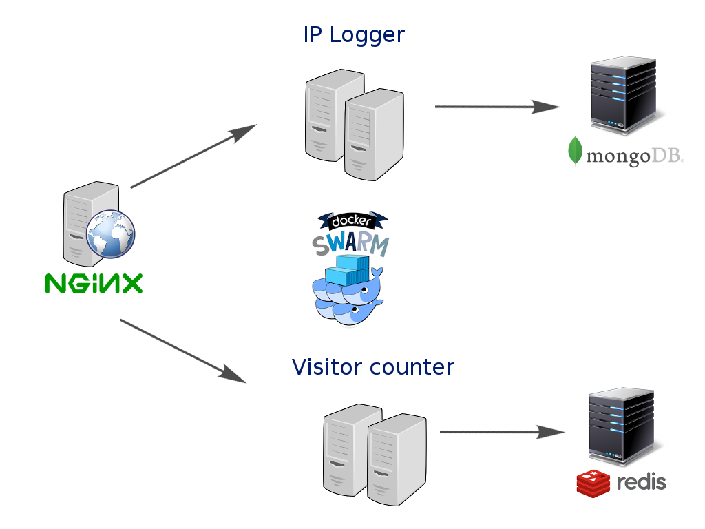

# Continuous Deployment with Docker

## Description

This project shows a web application built using a microservices architecture.

There are two microservices:
    - *rest-count* implemented in Python (Flask microframework) using a Redis database
    - *rest-ip* implemented in Node.js (Express framework) using a Mongodb database

Using consul-template you can generate a dynamic Nginx configuration so that you can deploy new microservices version with no downtime.

You can find additional information on my [Slideshare presentation "Always be shipping"](http://www.slideshare.net/francescou/always-be-shipping)



## Prerequisites

Docker 1.8.3

docker-compose 1.4.2

## Getting started

Run the following commands in terminal (the first time you have to wait for a few minutes to download the Docker base images):

```
docker build -t rest-count rest-count/

docker build -t rest-ip rest-ip/

docker-compose -f application/docker-compose.yml up -d
```

open your browser to http://localhost:8080/

you can check the Consul state on http://localhost:8500/ui/

now edit rest-count/main.py (for example, you can increase the version to 1.1)

```
docker build -t rest-count rest-count/

docker-compose -f application/docker-compose.yml up -d restcountprimary

sleep 15

docker-compose -f application/docker-compose.yml up -d restcountbackup
```


## Scaling microservices

this section will explain how to can scale up and down _docker-compose_ services.

open your browser to `http://localhost:8500/ui/`. There you will find a _rest-count_ service, running on two nodes (one primary and one backup). Note that each node is a Docker container. Execute

    docker-compose -f application/docker-compose.yml scale restcountprimary=3

check again `http://localhost:8500/ui` to ensure that there are now four _rest-count_ instance (three primary and one backup).

Make a few requests to `http://localhost:8080/api/v1/count` and then run `docker-compose -f application/docker-compose.yml logs` to see how requests are processed by different _rest-count_ instances.

You can now scale down the _rest-count_ service without having any down time, e.g.:

    docker-compose -f application/docker-compose.yml scale restcountprimary=2

Again, you can check `http://localhost:8500/ui` to see that there are now only two primary instances.
